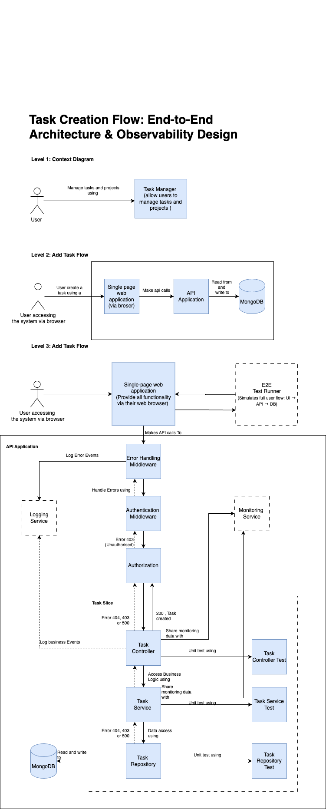

# Task Manager

A modern task management application built with React and TypeScript, featuring offline support and a clean, intuitive interface.

## Problem it Solves

Task Manager addresses the need for a simple, efficient, and user-friendly way to manage daily tasks. It provides:

- Centralized task organization
- Priority-based task management
- Task status tracking
- Local data persistence
- Clean and intuitive user interface

## 🚀 Live Demo

Check out the live demo at [https://nova-task-manager.netlify.app/](https://nova-task-manager.netlify.app/)

## ✨ Features

- **Task Management**

  - Add new tasks with title and description
  - Delete tasks
  - Mark tasks as complete/incomplete
  - View task details and status
  - Archive completed tasks

- **User Experience**
  - Clean and intuitive interface
  - Responsive design for all devices
  - Offline support with local storage
  - Real-time task status updates
  - Error handling and loading states

## 🏗️ Architecture

The application follows a layered architecture pattern designed for scalability and maintainability.

### System Architecture Diagram



The architecture is divided into three main levels:

1. **Context Level**

   - High-level system overview
   - User interaction with Task Manager system

2. **Application Flow Level**

   - Single-page web application
   - API communication
   - Database interactions

3. **Detailed Implementation Level**
   - Error handling middleware
   - Authentication & Authorization
   - Task management components
   - Data persistence layer
   - Testing strategy

Key architectural features:

- Clean separation of concerns
- Error handling at every layer
- Built-in monitoring and logging
- Comprehensive testing approach
- Scalable data access patterns

## 🛠️ Tech Stack

- **Frontend**

  - React 18
  - TypeScript
  - Styled Components
  - React Router
  - Context API for state management

- **Development Tools**
  - Vite
  - ESLint
  - Prettier
  - TypeScript

## 🚀 Getting Started

### Prerequisites

- Node.js (v16 or higher)
- yarn

### Installation

1. Clone the repository:

```bash
git clone https://github.com/yourusername/task-manager.git
cd task-manager
```

2. Install dependencies:

```bash
yarn install
```

3. Start the development server:

```bash
yarn dev
```

4. Open your browser and navigate to `http://localhost:5173`

### Building for Production

To create a production build:

```bash
yarn build
```

The build artifacts will be stored in the `dist/` directory.

## 📝 License

This project is licensed under the MIT License - see the [LICENSE](LICENSE) file for details.
