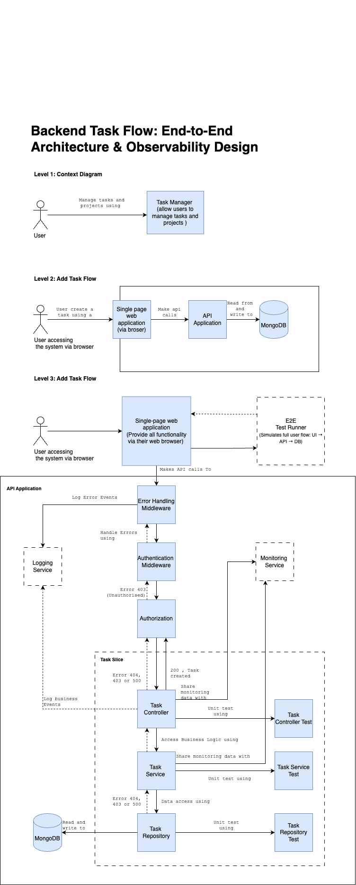

# Backend Architecture

## Overview

The backend follows a layered architecture pattern with clear separation of concerns, focusing on scalability, maintainability, and observability.

## Architecture Layers

### Level 1: Context Diagram

- Users interact with Task Manager system
- System provides task and project management capabilities
- Clear boundaries between user interactions and system functionality

### Level 2: Add Task Flow

The system implements a clean architecture for task creation:

1. **Single Page Application**

   - Frontend interface
   - Makes API calls to backend

2. **API Application**

   - RESTful endpoints
   - Data validation
   - Response formatting

3. **MongoDB Integration**
   - Data persistence
   - CRUD operations
   - Schema management

### Level 3: Detailed Implementation

The backend implements several key middleware and services:

1. **Error Handling Middleware**

   - Centralized error processing
   - Error logging and monitoring
   - Consistent error responses

2. **Authentication & Authorization**

   - User authentication
   - Role-based access control
   - Security middleware

3. **Task Management Components**

   - Task Controller

     - Request handling
     - Business logic coordination
     - Response formatting

   - Task Service

     - Business logic implementation
     - Data validation
     - Error handling

   - Task Repository
     - Data access layer
     - MongoDB interactions
     - Query optimization

4. **Monitoring & Logging**
   - Error event logging
   - Business event tracking
   - Performance monitoring

## Key Features

- **Clean Architecture**

  - Clear separation of concerns
  - Dependency injection
  - Interface-driven development

- **Security**

  - Authentication middleware
  - Authorization checks
  - Input validation

- **Data Management**

  - MongoDB integration
  - Repository pattern
  - Transaction support

- **Observability**
  - Comprehensive logging
  - Error tracking
  - Performance monitoring

## Development Guidelines

1. **API Development**

   - Follow RESTful principles
   - Implement proper validation
   - Document all endpoints

2. **Error Handling**

   - Use middleware approach
   - Implement proper logging
   - Return consistent responses

3. **Testing**

   - Unit test all components
   - Integration test APIs
   - E2E test critical flows

4. **Security**
   - Validate all inputs
   - Implement proper auth
   - Follow security best practices
