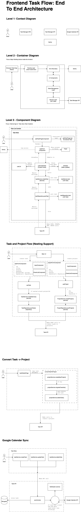

# Frontend Architecture

## Overview

The frontend application follows a modern React architecture with TypeScript, focusing on component reusability, state management, and clean architecture principles.

## Architecture Layers

### Level 1: Context Diagram

- User interacts with Task Manager SPA
- SPA communicates with Task Manager API
- Error tracking with Sentry integration

### Level 2: Container Diagram

Major building blocks inside the frontend:

1. **Browser/Client App (React)**

   - Entry point for user interactions
   - React-based SPA implementation

2. **Routing Layer**

   - Uses react-router-dom
   - Handles navigation and route management

3. **Error Boundary**

   - Global error handling
   - Integration with Sentry
   - User-friendly error messages

4. **UI Components**

   - Reusable component library
   - Styled with styled-components
   - Responsive design patterns

5. **State Management Layer**

   - Context API for global state
   - Custom hooks for local state
   - Efficient state updates

6. **Service Layer**
   - API call abstractions
   - Task Manager API integration
   - Error handling and retries

### Level 3: Component Diagram

Focus on Task Creation flow:

1. **Task List Context**

   - Global task state management
   - Task list operations

2. **Task Slice**

   - `addTaskPageComponent`
   - Form handling and validation
   - Success/error notifications

3. **Component Communication**
   - Custom hooks for task operations
   - Service integration
   - Unit test coverage

## Key Features

- **Component Architecture**

  - Modular design
  - Reusable components
  - Clear separation of concerns

- **State Management**

  - Context-based global state
  - Custom hooks for business logic
  - Efficient updates and renders

- **Error Handling**

  - Global error boundaries
  - Sentry integration
  - User-friendly error messages

- **Testing Strategy**
  - Unit tests for components
  - Integration tests for flows
  - E2E tests for critical paths

## Development Guidelines

1. **Component Creation**

   - Follow atomic design principles
   - Implement proper TypeScript types
   - Include unit tests

2. **State Management**

   - Use Context for global state
   - Implement custom hooks for logic
   - Follow immutability patterns

3. **Error Handling**

   - Implement error boundaries
   - Log errors to Sentry
   - Show user-friendly messages

4. **Testing**
   - Write unit tests for components
   - Add integration tests for flows
   - Maintain E2E test coverage
